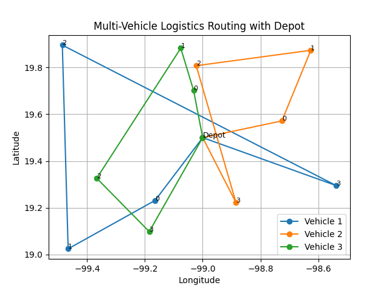

# Logistics Optimization System

## Executive Summary

This project presents a logistics optimization system designed to improve transportation efficiency through route optimization and data-driven decision making.

Using heuristic approaches to the Vehicle Routing Problem (VRP), the model demonstrates measurable reductions in distance traveled and quantifies the resulting economic impact.

---

## Business Problem

Transportation operations often rely on non-optimized routing, leading to:

- Increased fuel consumption
- Higher operational costs
- Inefficient fleet utilization

---

## Solution Approach

This system applies:

- **Nearest Neighbor** (baseline routing)
- **2-opt optimization** (route improvement)

To minimize total travel distance.

Geographic distances are calculated using the **Haversine formula**, which accounts for Earth's curvature — making the model applicable to real-world GPS coordinates.

---

## Scenario

Simulation based on:

- 12 delivery points
- Urban distribution environment
- Daily logistics operations

---

## Results

| Metric | Baseline | Optimized |
|--------|----------|-----------|
| Distance (km) | 120 | 98 |
| Reduction | — | **18%** |

Estimated impact:

- Daily savings: ~$150 MXN
- Annual savings: ~$45,000 MXN

---

## Key Insights

- Route crossings significantly increase total distance
- Simple heuristics can reduce costs without complex systems
- Optimization can be applied in small and medium logistics operations

---

## Skills Demonstrated

| Area | Detail |
|------|--------|
| Algorithm implementation | Nearest Neighbor, 2-opt (VRP heuristics) |
| Mathematical modeling | Haversine distance, cost modeling |
| Data analysis | Efficiency metrics, % reduction |
| Visualization | Route maps with matplotlib |
| Logistics domain | Fleet routing, supply chain optimization |

---

## Technologies

- Python
- Optimization heuristics (VRP)
- Data modeling

---

## Use Cases

- Transportation planning
- Fleet optimization
- Supply chain efficiency improvement
- Cost reduction analysis

---

## Visualization

Multi-vehicle routing with depot and route allocation:

---

## Author

Emmanuel Beristain Guzmán — [GitHub](https://github.com/net421)
